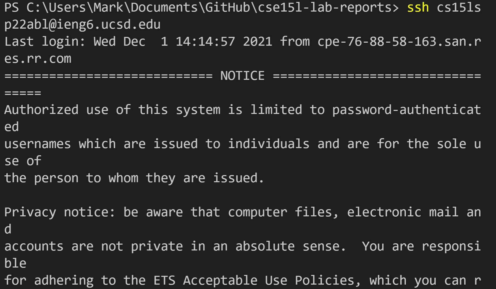

# Lab Report 1

1. ## Installing VScode

In order to download VS Code we need to go to the VScode website and just press download file. Make sure to also download java as well if you don't have it already. Also you should also download theOpenSSH here as well in order to remote connect to the server.

---
2. ## Remotely Connecting

In order to connect to the server we had to open up VS code and loagin doing ssh then our lab email.  Then type yes and your password and boom your remotely log on to the server!

---
3. ## Trying Some Commands

Since the server is running on linux we had some cool commands that we could use. I tried accessing one of my groupmates folder by using cd then his folder, but I got permission denied. This probably happened because he didn't give anyone access to access his files.

---
4. ## Moving Files with scp

Here we were given a java file and we wanted to move that file from our local system to the server. In order to do this we had to do scp (which stands for secure copy) followed by the java file then our lab email. After that we put in our password and to check that it actually trnasfered we just run the java file from the server by doing java (file name)

---
5. ## Setting an SSH Key

For this step we needed to create a keygen. We do this in order to save time when we login the server from our terminal since we no longer have to put the password. In order to do this ssh keygen on our local terminal then we should get a public key. Lastly we would want to copy that public key onto the server. Once you do that you no longer have to enter your password, you can just do ssh then your server email.

---
6. ## Optimizing Remote Running

In order optimitze our time and be as efficient as possible we can run multiple commands in one line just from our local terminal. For example lets say I want to move a file and run it on the server. I would do scp (filename) then ;(do this after every command that you want to run) then ssh our lab email then ; then if you want to run any java commands you would want to put it around "" and end it with ;.

---

