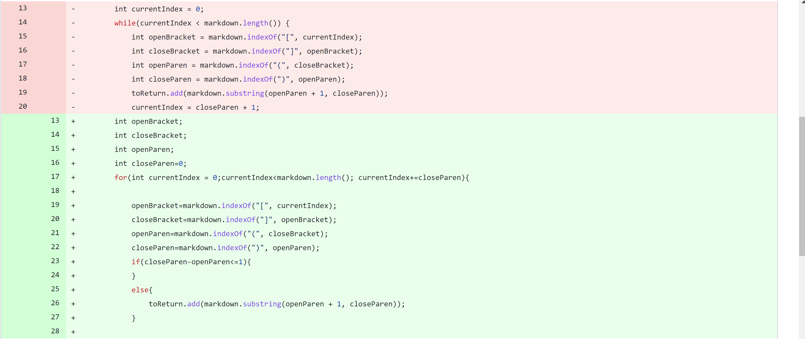
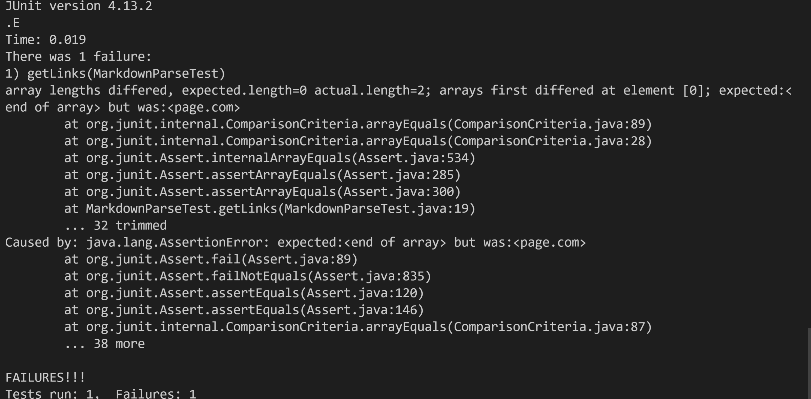
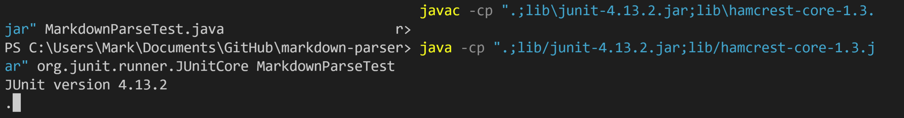
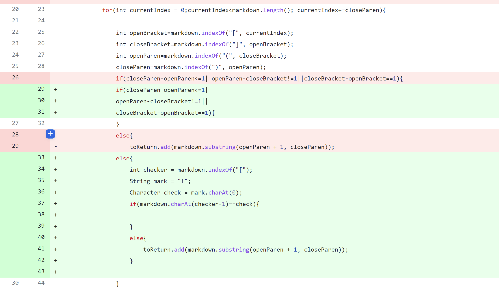
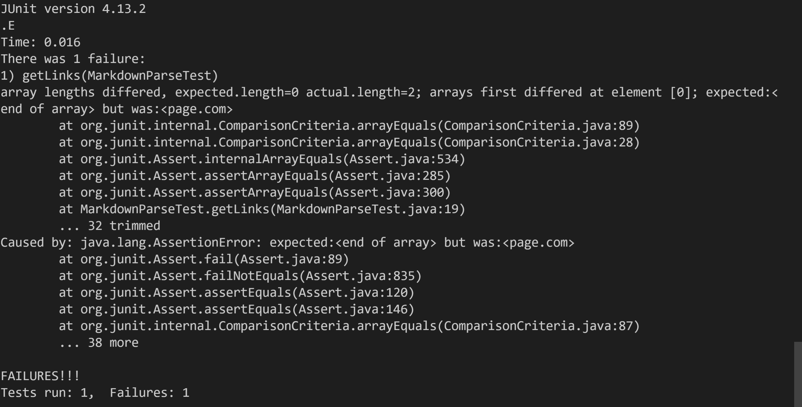

# __Lab Report 2__

## __Bug 1__
---

### Changes that were made

### Link to the test case that made it fail

[Test-File5](https://github.com/markruangrattham/markdown-parser/blob/main/test-file5.md?plain=1)

### Symptom of the input

### Why the bug happened?

>This bug happened because the
the way the code was coded was to only look at the index of *")"* and *"["*. It didn't take take into account the distance between the two needs to be **one** or else it wouldn't be consider a link according to markdwon. Thats why we added an if statment that checks if the difference between the openbracket and closeparen has to be one otherwiese it wouldn't be added to the array.
>
---
## __Bug 2__
---

### Changes that were made
.png)

### Links to the test case that made it fail

[Test File 7](https://github.com/markruangrattham/markdown-parser/blob/main/test-file7.md)

### Symptom of the input

(runtime error been like this for a solid mintue)

### Why the bug happened?
>The code will go in an infinite loop because it doesn't know where to start and end. Since the way we coded this was it looks for four things which is the *"("* ,  *")"* , *"["* , *"]"* if these four things don't exist their might be an error that happens and in this case an infinite loop that doesn't stop. Since this test case is missing the *"("* and the *"]"* its messing with the for loop. In order to fix this we can add an *if* statment that checks if the markdown has atleast a lenghth of 4 and we can use the contain method to check if it cotains all four ( *"("* ,  *")"* , *"["* , *"]"* ) of the things we are looking for if it doesn't the for loop will not run resulting in an empty array.
>

---

## __Bug 3__

---

### Changes that were made

### Link to the test case that made it fail
[Test File 8](https://github.com/markruangrattham/markdown-parser/blob/main/test-file6.md?plain=1)

### Symptom of the input

### Why the bug happened?
>This bug happened because the code didn't take into considertion that markdown has similar formatting for images and links.Meaning that it may add the image name into the array. In order to fix this we need to add a *if* statemnt that sees if there a *"!"* before the openBracket, if there is we don't add whatever in the *( )* into the array.
>

