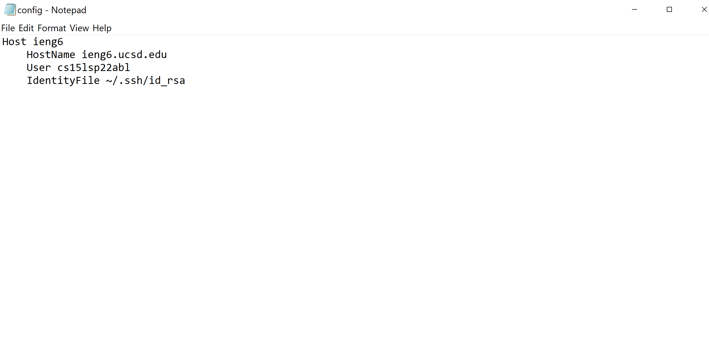
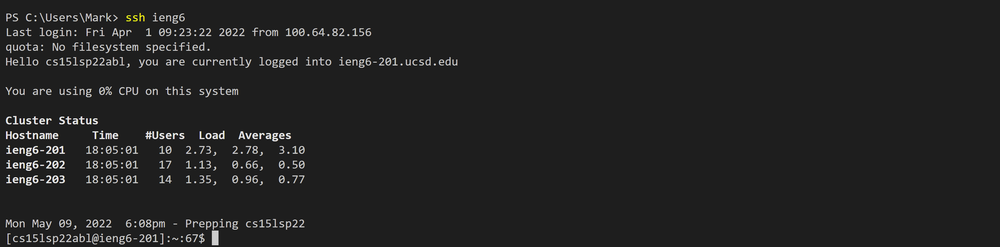
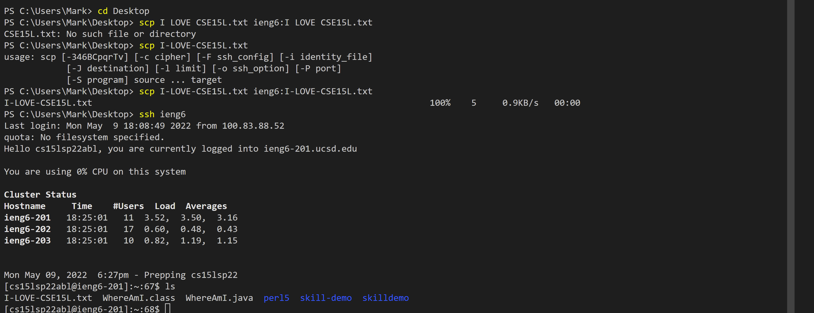
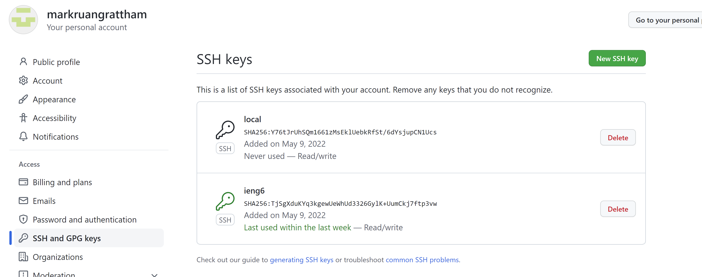
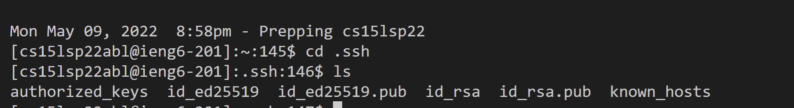
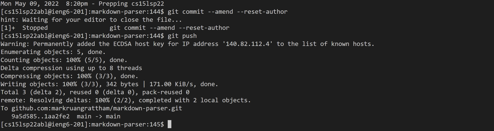

# __Lab Report 3__

## **Streamlining ssh Configuration**

---

### Show your .ssh/config file, and how you edited it (with VScode, another program, etc)

> 1. Open a new terminal and change the directory to .ssh by doing *cd .ssh*
>2. Then create we need to run some linux command and since I'm on windows I needed to install wsl. I then do *wsl* in order to be able to run linux commands.
>3. Then I had to create a file call "config" so we needed to do *touch config* which creates the config file.
>4. Then I had to do *nano config* which allows me to edit the config file and I then copied the command from the wirteup and pasted it onto the config file.
>5. Finally I tried logging in by doing ssh ieng6 and it worked!
>

### Show the ssh command logging you into your account using just the alias you chose.

### Show an scp command copying a file to your account using just the alias you chose.

---
## **Setup Github Access from ieng6**
---

### Show where the public key you made is stored on Github and in your user account (screenshot).

### Show where the private key you made is stored on your user account (but not its contents) as a screenshot.

### Show running git commands to commit and push a change to Github while logged into your ieng6 account.

