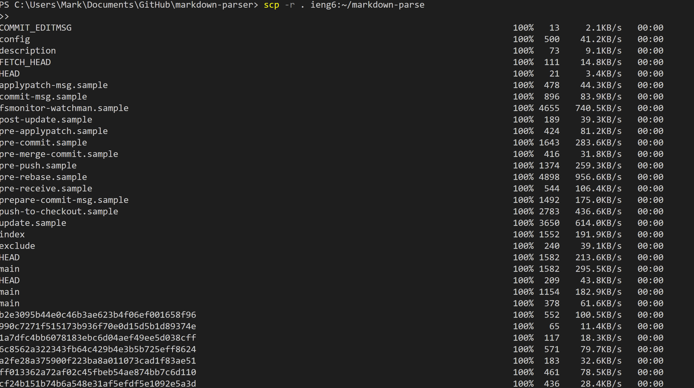

# __Lab Report 3__

## **Streamlining ssh Configuration**

---

### Show your .ssh/config file, and how you edited it (with VScode, another program, etc)

> 1. Open a new terminal and change the directory to .ssh by doing *cd .ssh*
>2. Then create we need to run some linux command and since I'm on windows I needed to install wsl. I then do *wsl* in order to be able to run linux commands.
>3. Then I had to create a file call "config" so we needed to do *touch config* which creates the config file.
>4. Then I had to do *nano config* which allows me to edit the config file and I then copied the command from the wirteup and pasted it onto the config file.
>5. Finally I tried logging in by doing ssh ieng6 and it worked!
>

### Show the ssh command logging you into your account using just the alias you chose.

>As you can see I can now do *ssh ieng* and it will log me into the server. I no longer have to put my whole email!
>

### Show an scp command copying a file to your account using just the alias you chose.

>Did this by doing *scp (filename) ieng6:(desire filename on server)
>

---
## **Setup Github Access from ieng6**
---

### Show where the public key you made is stored on Github and in your user account (screenshot).

### Show where the private key you made is stored on your user account (but not its contents) as a screenshot.

### Show running git commands to commit and push a change to Github while logged into your ieng6 account.

### Show a link for the resulting commit.
[Link to the commiting result!](https://github.com/markruangrattham/markdown-parser/commit/1aa2fe28a375900f223ba8a011073cad1f83ae51)

---
## **Copy whole directories with scp -r**
---

### Show copying your whole markdown-parse directory to your ieng6 account.

### Show logging into your ieng6 account after doing this and compiling and running the tests for your repository.

### Show (like in the last step of the first lab) combining *scp, ;*, and ssh to copy the whole directory and run the tests in one line.

>Command that was used:

>*scp -r *.java *.md lib/ ieng6:markdown-parse ; ssh ieng6 "cd markdown-parse; /software/CSE/oracle-java-17/jdk-17.0.1/bin/javac -cp .:lib/junit-4.13.2.jar:lib/hamcrest-core-1.3.jar MarkdownParseTest.java; /software/CSE/oracle-java-17/jdk-17.0.1/bin/java -cp .:lib/junit-4.13.2.jar:lib/hamcrest-core-1.3.jar org.junit.runner.JUnitCore MarkdownParseTest"*
>

