# __Lab Report 4__

## __Links to both markdown-parse repository__
---
### [Mine code](https://github.com/markruangrattham/markdown-parser)

### [Preson I reviewed](https://github.com/mrreganwang/markdown-parser)

---
## __Snippet 1__
---

### __What Snippet 1 looked like__
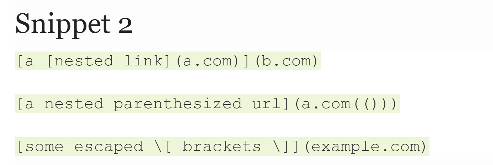

### __What the expected output should look like__
>["'goole.com","google.com","ucsd.edu"]

### __What the test look like in MarkdownParseTest.java__
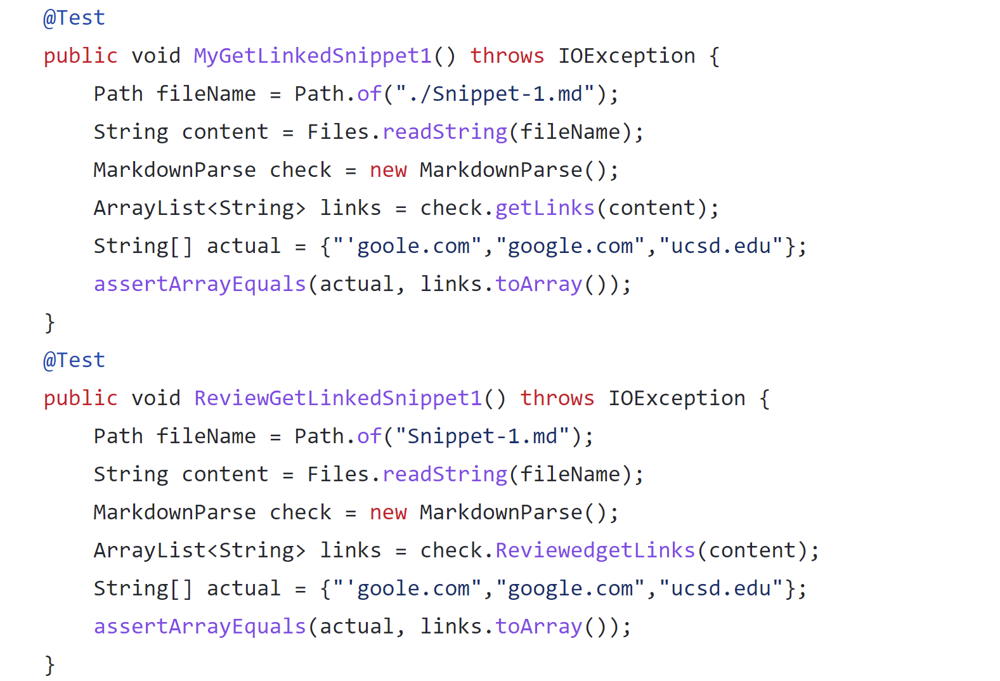

### __Output for my test__
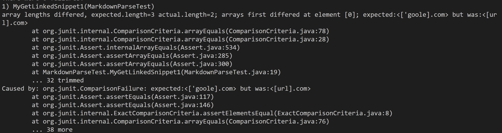

### __Output for reviewed test__
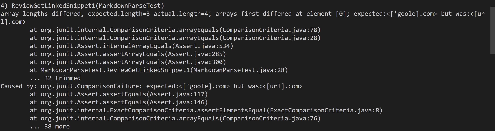

### __Question__

Do you think there is a small (<10 lines) code change that will make your program work for snippet 1 and all related cases that use inline code with backticks? If yes, describe the code change. If not, describe why it would be a more involved change.

>In order to fix this part of the code I feel like I can make a really small change. I would need to check if there is a char before the the open [. If there is one then it wouldn't be considered as a link. All I would need is one if statemnt to check.
>

---
## __Snippet 2__
---

### __What Snippet 2 looked like__
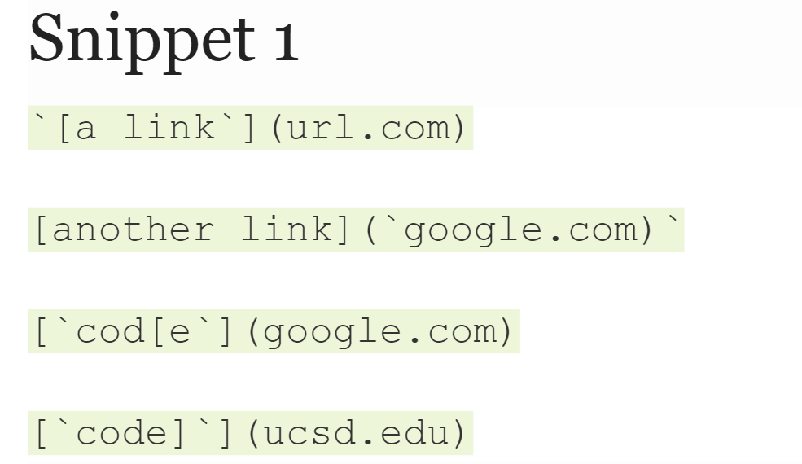

### __What the expected output should look like__
>["a.com","a.com(())","example.com"]

### __What the test look like in MarkdownParseTest.java__
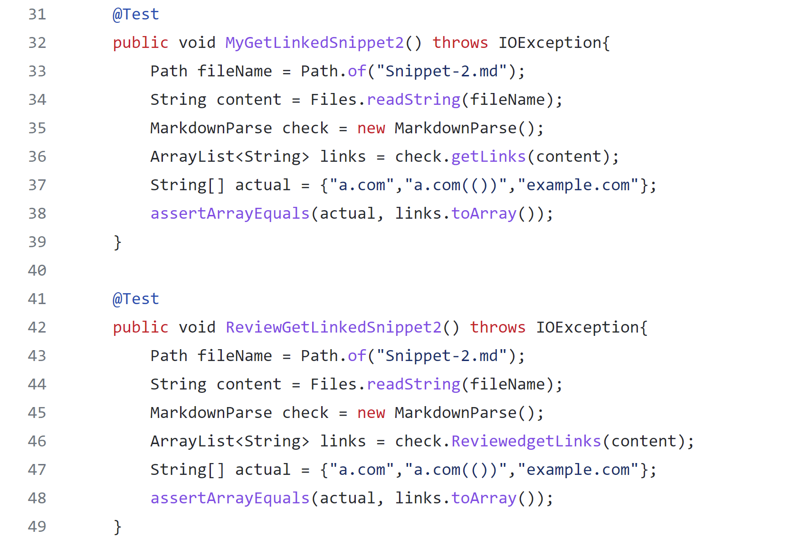

### __Output for my test__
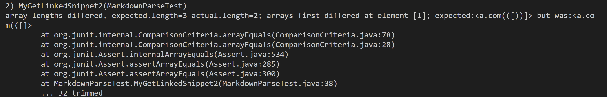

### __Output for reviewed test__
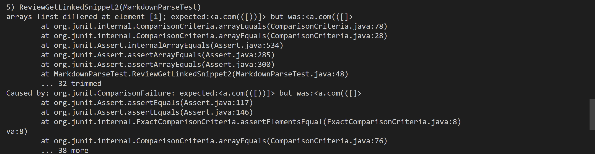

### __Question__
Do you think there is a small (<10 lines) code change that will make your program work for snippet 2 and all related cases that nest parentheses, brackets, and escaped brackets? If yes, describe the code change. If not, describe why it would be a more involved change.
>In order to fix this part of the code I feel like I can do it with a small amount of changes. For this one I have to check if the ( ) are back to back if so then its not not a link and then I would have to make a loop that will have to check for the next close ) and that would be the index that I would use for the link in the array.
>

---
## __Snippet 3__
---

### __What Snippet 3 looked like__
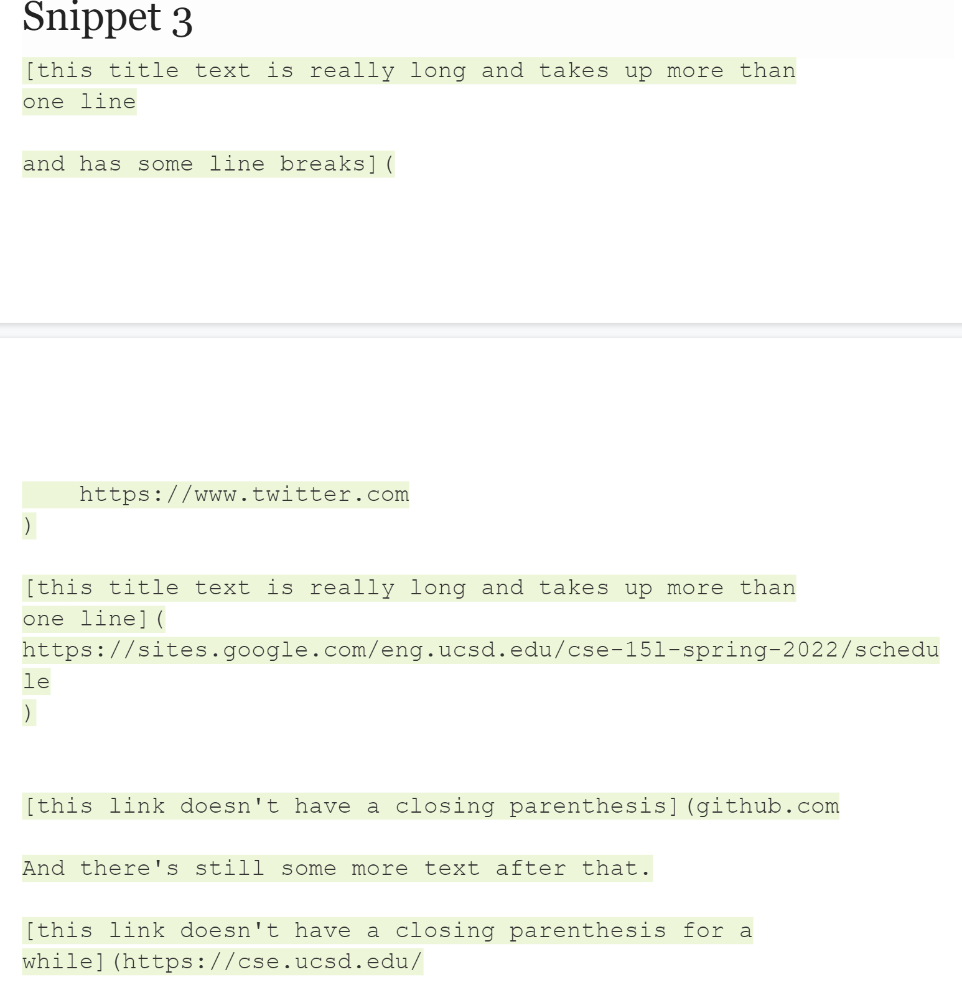

### __What the expected output should look like__
>["https://www.twitter.com","https://sites.google.com/eng.ucsd.edu/cse-15l-spring-2022/schedule" , "https://cse.ucsd.edu/"]

### __What the test look like in MarkdownParseTest.java__
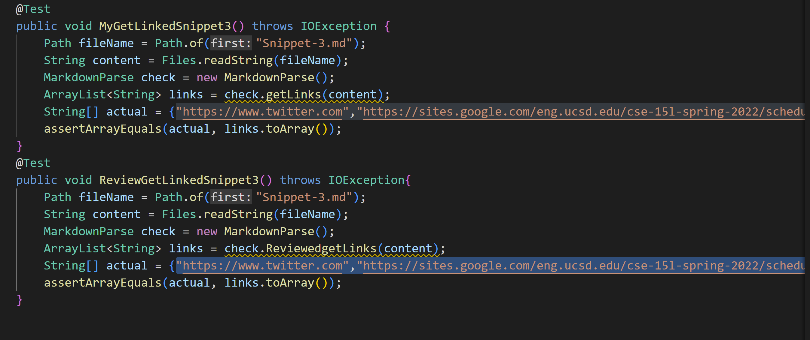

### __Output for my test__
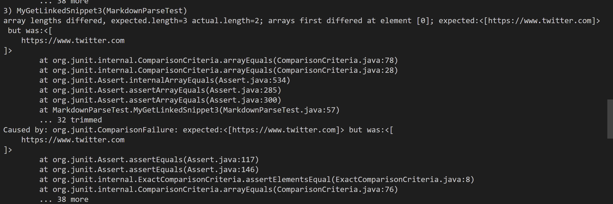

### __Output for reviewed test__
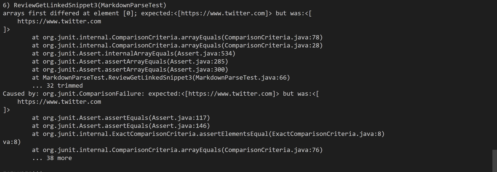

### __Question__
Do you think there is a small (<10 lines) code change that will make your program work for snippet 3 and all related cases that have newlines in brackets and parentheses? If yes, describe the code change. If not, describe why it would be a more involved change.
>In order to fix this part of the code I feel like I can do it with a small amount of changes. I think I would just need to check if there a /n before the link if there is I would just igrone it because thats whats messing up the array right now.
>

