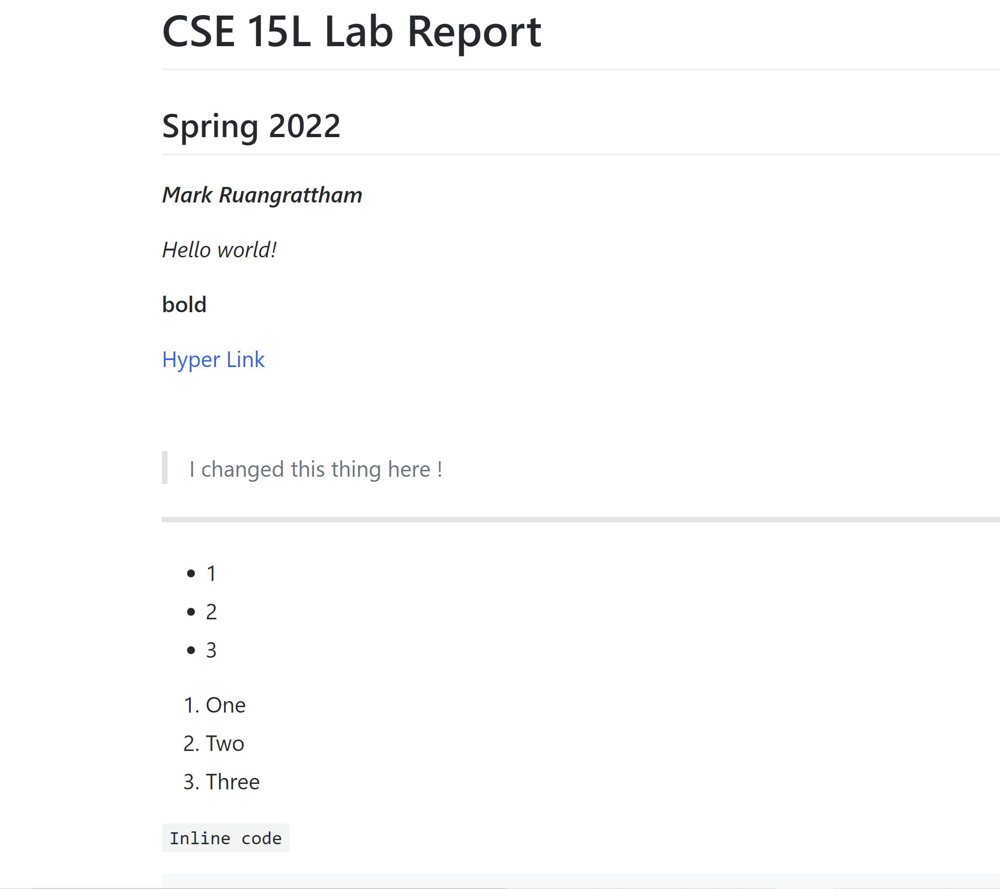
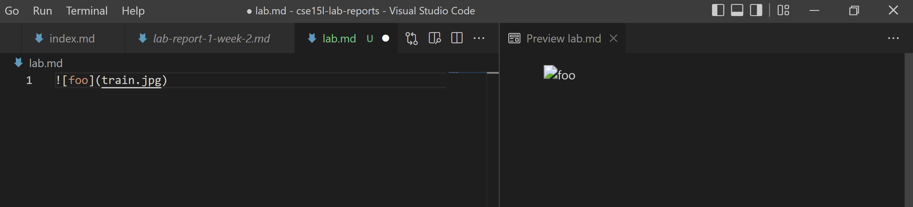
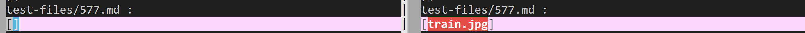
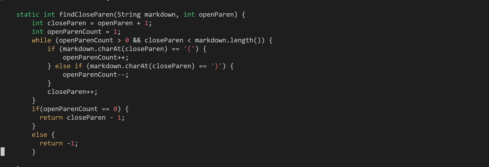
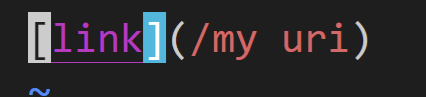
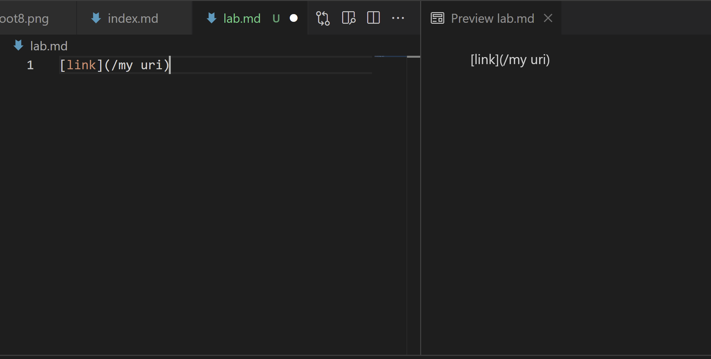
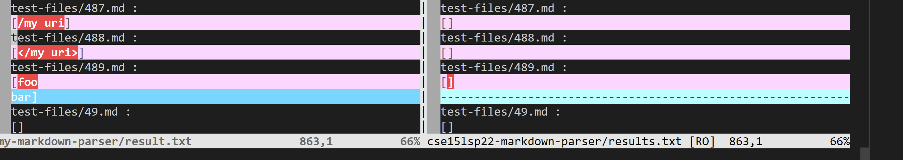
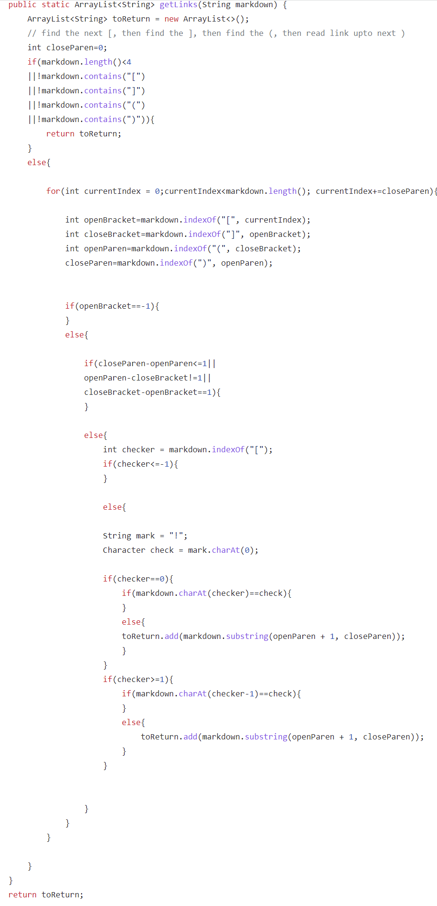

# __Lab Report 5__

## How you found the tests with different results ?
---

In order to find the difference between the two test result, I used the `vim` command to see the result output of both the one I cloned from the and my own. The command I used was 
>vim diff my-markdown-parser/results.txt cse15lsp22-markdown-parser/result.txt
>

This command is a tool in `vim` that allow me to see the two txt file side by side and see the difference between them. After that I would open the test file using `vim "file name" `. After that I would copy and paste the test file into an empty "md" file and see the preview to see what the exact output should look like. The two test files I decided to use were [577](https://github.com/nidhidhamnani/markdown-parser/blob/c7680904bc390e500c7c98e4789d1410249c2982/test-files/577.md) and [487](https://github.com/nidhidhamnani/markdown-parser/blob/c7680904bc390e500c7c98e4789d1410249c2982/test-files/487.md).

---

## Test file 577
---
### What the  look likes:

### What the preview looks like in VSCODE:

### What the outputs look like form `vim`

(Left one is mine the right one is the one from the wirteup)

### Code in wirteup

### Why its not working properly

I believe that the code in the wirteup isn't working as expected because the code doesn't take into account if the the link is formated as a image. The code forgot to take into account that markdown formats links and images in a  very similiar way way. The only difference is that an image has a ! in front of the [] and a link doesn't. As you can clearly see the code doesn't take this into account and it belives that train.jpg is a url to a website.

---

## Test file 487

---

### What the  look likes:

### What the preview looks like in VSCODE:

### What the outputs look like form `vim`

### What my code look like that cause it to fail

### Why its not working properly
I think that my code isn't working as expected because it doesn't take into account "/" before the URL. In markdown if their is a "/" before the actual link it won't consider it and link and just think it as a block of two text. However my code doesn't take this into account and just read it as a normal link because it follows the link format the only time that it breaks is the "/" part.

